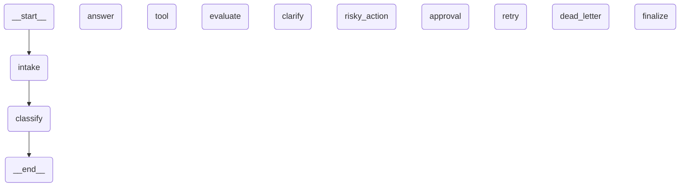

# LangGraph Architecture Diagram

Generated via `graph.get_graph().draw_mermaid()`



## Legend

- **Nodes**: rectangles represent processing nodes (intake, classify, tool, etc.)
- **Edges**: arrows represent control flow transitions
- **Conditional**: diamonds represent routing decisions (classify, evaluate, approval, retry)
- **START/END**: special nodes marking graph boundaries

## Key Paths

1. **Simple Route**: START → intake → classify → answer → finalize → END
2. **Tool Route**: START → intake → classify → tool → evaluate → answer → finalize → END
3. **Risky Route**: START → intake → classify → risky_action → approval → [tool/clarify] → finalize → END
4. **Error/Retry**: START → intake → classify → retry → tool → evaluate → [retry/answer] → finalize → END
5. **Dead Letter**: Any path with exhausted retries → dead_letter → finalize → END

## Generating Updated Diagrams

To regenerate after code changes:

```bash
python -m langgraph_agent_lab.cli draw-graph --output outputs/graph_diagram.md
```

Or directly in Python:

```python
from langgraph_agent_lab.graph import build_graph

graph = build_graph()
diagram = graph.get_graph().draw_mermaid()
print(diagram)
```
