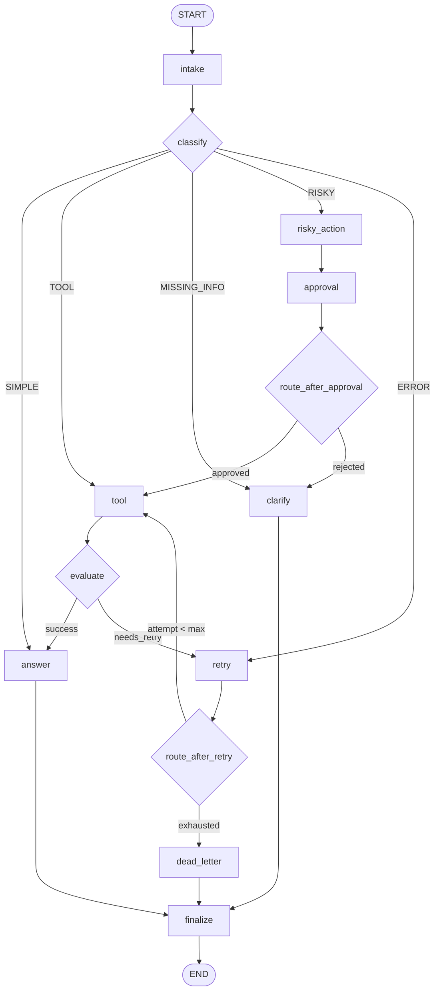

# Day 08 Lab Report

## 1. Team / student

- Name: Lê Hoàng Đạt - 2A202600377
- Repo/commit: `https://github.com/eltad2003/phase2-track3-day8-langgraph-agent/commits/main/`
- Date: `11/05/2026`

## 2. Architecture

The graph is built as a linear intake-to-classification front end with conditional branches for safe, tool-based, missing-info, risky, and error scenarios. The main path is `START -> intake -> classify`, then routing decides whether the run goes to `answer`, `tool`, `clarify`, `risky_action`, or `retry`.

The risky path adds a human approval gate before any tool/action continues. The tool path always passes through `evaluate` so the graph can decide whether to finish or loop back into retry. Every branch terminates through `finalize -> END`, so the graph remains bounded and gradeable.

### Graph Flow Diagram

Key features:

- **Route-based branching:** `classify_node` determines path based on keywords
- **Retry loop:** `tool → evaluate → retry → tool` with bounded attempts
- **Approval gate:** risky actions require human approval before execution
- **Dead-letter path:** unresolvable failures are logged for manual review
- **Unified exit:** all paths converge at `finalize → END` for graceful termination

## 3. State schema

The state uses a lean typed schema with a mix of overwrite and append-only fields. Append-only fields store the trace, while overwrite fields represent the current decision point.

| Field | Reducer | Why |
|---|---|---|
| messages | append | audit conversation/events |
| tool_results | append | keep full tool trace for evaluation |
| errors | append | preserve retry/failure history |
| events | append | append-only execution log for debugging |
| route | overwrite | current route only |
| risk_level | overwrite | current risk classification |
| attempt | overwrite | current retry counter |
| approval | overwrite | latest approval decision only |
| evaluation_result | overwrite | latest tool evaluation result |
| final_answer | overwrite | only latest answer matters |
| pending_question | overwrite | only current clarification is needed |

## 4. Scenario results

The table below is taken from `outputs/metrics.json`.

| Scenario | Expected route | Actual route | Success | Retries | Interrupts |
|---|---|---|---:|---:|---:|
| S01_simple | simple | simple | true | 0 | 0 |
| S02_tool | tool | tool | true | 0 | 0 |
| S03_missing | missing_info | missing_info | true | 0 | 0 |
| S04_risky | risky | risky | true | 0 | 1 |
| S05_error | error | error | true | 2 | 0 |
| S06_delete | risky | risky | true | 0 | 1 |
| S07_dead_letter | error | error | true | 1 | 0 |

Summary metrics:

- Total scenarios: 7
- Success rate: 100.0%
- Average nodes visited: 6.43
- Total retries: 3
- Total interrupts: 2
- Resume success: false

## 5. Failure analysis

1. Retry or tool failure: transient tool errors are detected in `evaluate_node` and routed to `retry` until `max_attempts` is reached. In the sample run, the error scenarios retried before success or dead-letter handling.
2. Risky action without approval: risky queries such as refund/delete go through `risky_action -> approval` before any tool execution. If approval is rejected, the flow returns to clarification instead of silently continuing.

## 6. Persistence / recovery evidence

The run uses a memory checkpointer by default, and each scenario is assigned a unique `thread_id` in `initial_state`. That makes the graph traceable run by run. In addition, dead-letter records are persisted to `outputs/dead_letters/` as JSON files so failed cases can be inspected later.

## 7. Extension work

I completed dead-letter persistence and richer markdown reporting. The lab also supports an interactive approval path through `LANGGRAPH_INTERRUPT=true`, and the CLI writes both metrics and report output in a repeatable way.

## 8. Improvement plan

If I had one more day, I would productionize the evaluation step first by replacing the rule-based checker with an LLM-as-judge or structured validator. After that, I would add stronger persistence for dead-letter records, better tracing, and a more explicit answer-grounding step so final responses always cite tool output and approval context.
